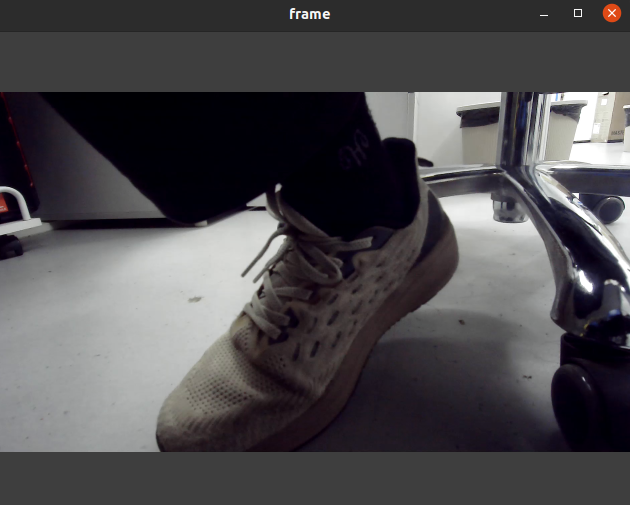

这里主要是连接ROV
读取mavlink,gstreamer数据并发送出来

gst_reader.py: 将gst格式的图像数据流转化为opencv格式的图像
mav_bridge.py: 负责利用mavlink进行通信


bluerov_node.py 通过rostopic发布ROV信息(由gst、mavlink获取)，订阅topic控制ROV,
它将作为一个node独立运行.
BlueRov类继承自MAVBridge


发布的topic:
/BlueRov2/battery  发布电池信息
/BlueRov2/camera/image_raw 发布图像信息
/BlueRov2/state  ROV状态(自定义类型)， 包括锁定状态(arm)、rc1-rc6六个通道状态,light,camera(云台角度),mode
/BlueRov2/imu/data Imu格式的imu数据(旋转由四元数表示)
/BlueRov2/odometry 绝对轨迹 ，这里没有gps应该是无效的,未来做跟踪的话可能有用
/BlueRov2/bar30 深度传感器数据
/BlueRov2/imu/attitude rpy格式的IMU数据 

订阅的topic:
/BlueRov2/setpoint_velocity/cmd_del 设置角速度和线速度
/BlueRov2/servo{}/set_pwm 设置电机的pwm
/BlueRov2/rc_channel{}/set_pwm 设置RC通道的pwm
/BlueRov2/mode/set 设置模式
/BlueRov2/arm 设置锁定状态
/BlueROV2/manual_control 接收手柄控制信号

测试 test/test_gst_reader.py 
结果：


测试 test/test_mavlink_reader.py 
结果：


```bash
## 测试命令
# Set manual mode
$ rostopic pub -1 /BlueRov2/mode/set std_msgs/String "manual"
# Arm the vehicle
$ rostopic pub -1 /BlueRov2/Setting/arm std_msgs/Bool 1
# Set angular and linear speed
$ rostopic pub -r 4 /BlueRov2/setpoint_velocity/cmd_vel geometry_msgs/TwistStamped "{header: auto, twist: {linear: {x: 10.0, y: 0.0, z: 0.0}, angular: {x: 0.0, y: 0.0, z: 0.0}}}"
# Set MAIN OUT pwm value
$ rostopic pub -r 4 /BlueRov2/servo1/set_pwm std_msgs/UInt16  1500
# Set THROTTLE pwm value  
$ rostopic pub -r 4 /BlueRov2/rc_channel3/set_pwm std_msgs/UInt16  1900
# Visualize camera image
$ rosrun image_view image_view image:=/BlueRov2/camera/image_raw
# See ROV state
$ rostopic echo /BlueRov2/state
# Watch battery information
$ rostopic echo /BlueRov2/battery
# IMU information
$ rostopic echo /BlueRov2/imu/data
```

测试/BlueRov2/Setting/arm 发现可能要发送多次解锁命令才能成功
rc_channel3是有效的, 
servo1无反应,但是通过手柄本身也无法操作单个电机

gst_reader的c++ 版本可以参考：https://www.codeleading.com/article/14562585841/