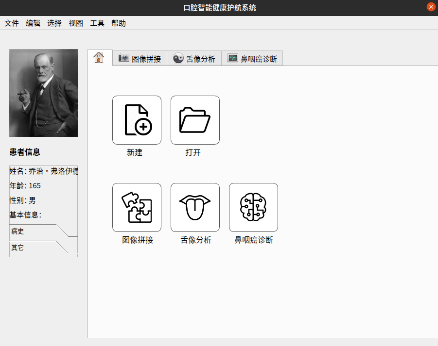

gui部分可以参考：

在起始页左上方放一张BlueRov的图片，
接下来：
写一些基本信息，
比如：
型号、自由度、推进器个数
状态信息
锁定、模式、电量、
接下来、
IMU信息
roll,pitch,yaw,accx,accy,accz,
Image信息
大小、帧率
其他：
灯亮度
云台角度

起始页包括：连接、解锁、IMU、相机、手动控制、定深、定姿、定速

将ui文件转换为py文件：
pyuic5 main_windows.ui -o mian_windows.py 

将qrc文件转换为py文件：
pyrcc5 img_rcc.qrc -o img.py 

先处理左侧的信息页，这里需要更新的信息有：
lock, 需要订阅/BlueRov2/state 
mode, 也是state
电量, 需要订阅/BlueRov2/battery

IMU信息，roll,pitch,yaw,accx,accy,accz 需要订阅/BlueRov2/imu/attitude
Image 信息， 大小、帧率 需要订阅/BlueRov2/camera/image_raw
其他信息 灯亮度 云台角度 仍在state内

image_raw 需要重新转回image类型

当前存在的问题：
1、每次刷新文本的方式，有时下拉看不了数据
2、云台角度读不了，灯的数据默认是50？
3、当前无法显示camera帧率
4、这些page的名字要该
5、代码ugly(init,update)

接下来处理主页的跳转

存在的问题：
1、代码ugly(多个callback其实是相似的)
2、连接、手动控制、定速的图标背景不对
3、连接和Arm还没有添加逻辑

接下来处理IMU的显示，感觉没啥用
1、imu需要添加当前数值的显示
2、排列比较难受
3、对每个subplot 设置标识

接下来处理camera的显示：
1、显示的图片有模糊的现象,gst读取后opencv显示没有问题，转成ros msg出了问题

下面处理手动控制：
需要订阅/BlueRov2/Setting/arm topic, 然后，将gamepad输入转化为 /BlueRov2/Command/joy,
由commander处理

存在的问题：还是这个锁定不够灵敏，多次发送才能成功

下面处理定深、定向、定速.
